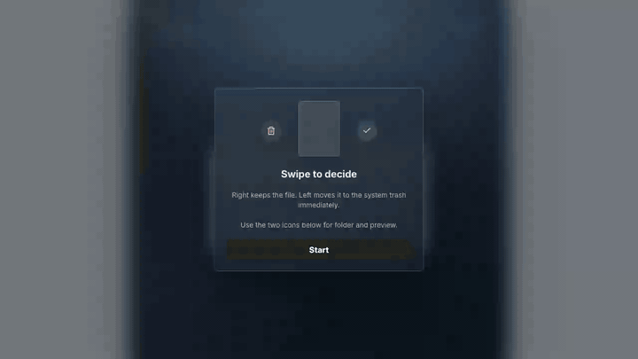

# SwipeTrash

SwipeTrash is a small desktop app for keeping your computer clean in 30 seconds
a day.

Open it, review a few old files from Downloads and Documents, then swipe right
to keep or left to move junk to the system trash. The point is to avoid the big
"I need to clean my computer" session by doing a tiny, low-friction pass every
day.

It runs on macOS, Windows, and Linux.

[Launched on Tiny Startups](https://www.tinystartups.com/startup/swipetrash)

## Demo

[Watch the WebM demo video](docs/assets/swipetrash-demo.webm)

## Download

Installers are available from the latest GitHub release:

https://github.com/FlowSync0/SwipeTrash/releases/latest

- macOS: `.dmg`
- Windows: `.exe`
- Linux: `.AppImage` and `.deb`

Current builds are unsigned. macOS Gatekeeper and Windows SmartScreen may show
a warning on first launch until the project has signing certificates.

## Why It Exists

Downloads folders get messy because most files are only useful for a moment:
old screenshots, copied archives, installers, exports, and duplicate downloads.
Classic cleaner apps can feel too aggressive, and manual cleanup takes enough
time that people postpone it.

SwipeTrash keeps the task small. It gives you a daily goal, shows one large file
preview at a time, and lets you make one simple decision: keep it or trash it.

## Safety

- Files are moved to the system trash, not permanently deleted.
- The default scan only looks at Documents and Downloads.
- Hidden files, application folders, game/mod assets, dependency folders,
  caches, source/build folders, keys, databases, and sensitive names are skipped.
- File actions go through a narrow Electron IPC bridge; the renderer does not
  get direct filesystem access.

## Features

- Swipe cards for quick keep/trash decisions.
- Large previews for images, videos, audio, PDFs, and text files.
- Daily cleanup goal instead of a huge file table.
- Settings for scan sources, language, and session size.
- Lifetime stats for files and data moved to trash.
- English, French, and Spanish UI.

## License

MIT
